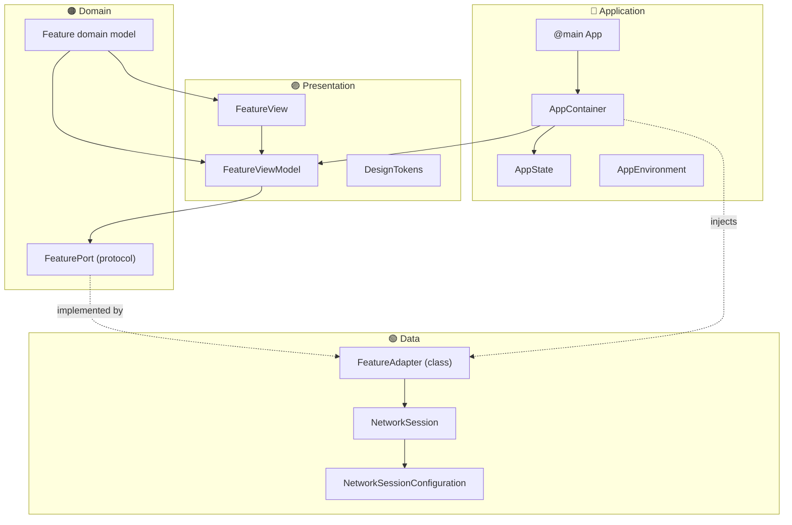
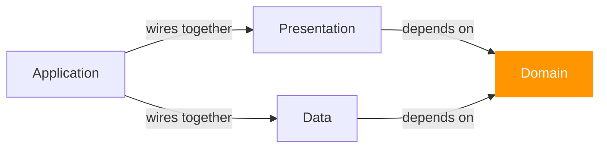
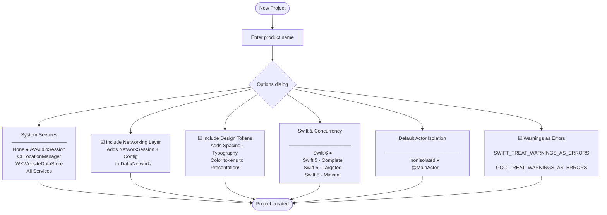

# Xcode Clean Architecture Templates

Xcode **file templates** and a **project template** for iOS 17+ apps built on clean / hexagonal (Ports & Adapters) architecture.

- **Swift 6** by default — full data-race safety at the point of project creation  
- **`@Observable`** ViewModels (iOS 17+ `Observation` framework, not `ObservableObject`)  
- **Ports & Adapters** naming throughout — `Port` (protocol / domain boundary), `Adapter` (data layer implementation)  
- **`make scaffold FEATURE=X`** — adds all four layer files for a new feature in one command; Xcode 15 filesystem-synced folders pick them up automatically

---

## Architecture Overview



### Dependency rule

Code dependencies flow **inward only** — Presentation and Data both depend on Domain; Domain depends on nothing outside itself.



---

## Requirements

| Requirement | Version |
|---|---|
| Xcode | 15.0 + |
| iOS deployment target | 17.0 + |
| Swift | 5.10 + (Swift 6 recommended) |
| macOS (development machine) | 14 Sonoma + |

---

## Installation

### One-liner (recommended for teams)

```bash
curl -fsSL https://raw.githubusercontent.com/chris-grantham/xcode-clean-architecture-templates/main/install.sh | bash
```

The script clones the repo to `~/.xcode-clean-arch-templates` and creates symlinks inside Xcode's template directory. Running it again (or `git pull`) updates the templates without touching Xcode.

### Manual

```bash
git clone https://github.com/chris-grantham/xcode-clean-architecture-templates.git
cd xcode-clean-architecture-templates
./install.sh
```

### Uninstall

```bash
~/.xcode-clean-arch-templates/install.sh --uninstall
```

After installing (or uninstalling), **restart Xcode** to refresh the template pickers.

---

## Project Template — New Project dialog

**File → New → Project → iOS → Clean Architecture**



### Generated project structure

```
MyApp/
├── MyApp.swift                 ← ⚠️ ancestor stub — safe to delete
├── ContentView.swift           ← ⚠️ ancestor stub — safe to delete
│
├── Application/
│   ├── MyApp.swift             ← @main entry point
│   ├── MyAppAppContainer.swift ← composition root
│   ├── AppState.swift          ← @Observable global state
│   └── AppEnvironment.swift    ← environment config (debug / release)
│
├── Presentation/
│   ├── ContentView.swift       ← root SwiftUI view
│   └── DesignTokens/           (if selected)
│       └── MyAppDesignTokens.swift
│
├── Data/
│   └── Network/                (if selected)
│       ├── NetworkSession.swift
│       └── MyAppNetworkSessionConfiguration.swift
│
├── Makefile
└── Scripts/
    └── scaffold_feature.sh
```

> **Source-root stubs:** The iOS project template ancestor forces `MyApp.swift` and `ContentView.swift` to be generated at the source root. Each is a comment-only stub with a deletion note — no Swift declarations, zero compile impact. Delete them once the project builds.

---

## File Templates — New File dialog

**File → New → File → Clean Architecture**

| Template | Layer | Description |
|---|---|---|
| **AppContainer** | Application | Composition root. Popup: None / AVAudioSession / CLLocationManager / WKWebsiteDataStore / All Services. Singleton *lifetime*, factory-method *access*. |
| **ViewModel** | Presentation | `@Observable @MainActor final class`. |
| **Repository** | Domain + Data | `FeaturePort` protocol + `FeatureAdapter` class in one file. Depend on the Port; never expose the Adapter. |
| **NetworkSession** | Infrastructure | `NetworkSession` protocol + `URLSession` retroactive conformance + `NetworkSessionError`. |
| **NetworkSessionConfiguration** | Infrastructure | Config struct + `buildRequest(path:method:body:headers:)`. |
| **DesignTokens** | Presentation | Popup: Spacing / Typography / Color / All Tokens. Color tokens backed by Asset Catalogue colour sets. |

### AppContainer pattern

```swift
// Singleton lifetime — created once at app launch
private lazy var _networkSession: any NetworkSession = URLSession.shared
private lazy var _userAdapter: any UserPort = UserAdapter(session: _networkSession)

// Non-singleton access — ViewModels are created fresh per scene/navigation
func makeUserViewModel() -> UserViewModel {
    UserViewModel(userPort: _userAdapter)
}
```

---

## Scaffold script

Add a new feature across all four layers with a single command:

```bash
make scaffold FEATURE=UserProfile
```

This creates:

```
MyApp/
├── Presentation/UserProfile/
│   ├── UserProfileView.swift       ← SwiftUI view (@State ViewModel)
│   └── UserProfileViewModel.swift  ← @Observable @MainActor
├── Domain/UserProfile/
│   └── UserProfile.swift           ← Identifiable, Hashable, Sendable
└── Data/UserProfile/
    └── UserProfileRepository.swift ← UserProfilePort + UserProfileAdapter
```

If an `MyAppTests/` folder exists (filesystem-synced), a Swift Testing stub is also created:

```
MyAppTests/
└── Features/UserProfile/
    └── UserProfileTests.swift
```

Wire the feature in `AppContainer`:

```swift
func makeUserProfileViewModel() -> UserProfileViewModel {
    UserProfileViewModel(userProfilePort: _userProfileAdapter)
}
```

### Naming conventions

| Concept | Name | Example |
|---|---|---|
| Domain boundary | `*Port` | `UserProfilePort` |
| Data implementation | `*Adapter` | `UserProfileAdapter` |
| Observable state | `AppState` | — |
| Composition root | `*AppContainer` | `MyAppAppContainer` |

---

## Build Settings Reference

Settings configured by the project template options:

| Option | Build Setting | Values |
|---|---|---|
| Swift 6 | `SWIFT_VERSION` | `6.0` |
| Swift 5 · Complete | `SWIFT_VERSION` + `SWIFT_STRICT_CONCURRENCY` | `5.0` + `complete` |
| Swift 5 · Targeted | `SWIFT_VERSION` + `SWIFT_STRICT_CONCURRENCY` | `5.0` + `targeted` |
| Swift 5 · Minimal | `SWIFT_VERSION` + `SWIFT_STRICT_CONCURRENCY` | `5.0` + `minimal` |
| @MainActor isolation | `SWIFT_DEFAULT_ACTOR_ISOLATION` | `MainActor` |
| Warnings as Errors | `SWIFT_TREAT_WARNINGS_AS_ERRORS` + `GCC_TREAT_WARNINGS_AS_ERRORS` | `YES` |

---

## Updating templates

Because the install script uses a symlink, updating is a single pull:

```bash
git -C ~/.xcode-clean-arch-templates pull
```

Restart Xcode for changes to take effect.

---

## Contributing

1. Fork the repository
2. Create a feature branch (`git checkout -b feat/my-change`)
3. Commit using [Conventional Commits](https://www.conventionalcommits.org/)
4. Open a pull request against `main`

---

## Licence

MIT — see [LICENSE](LICENSE).
